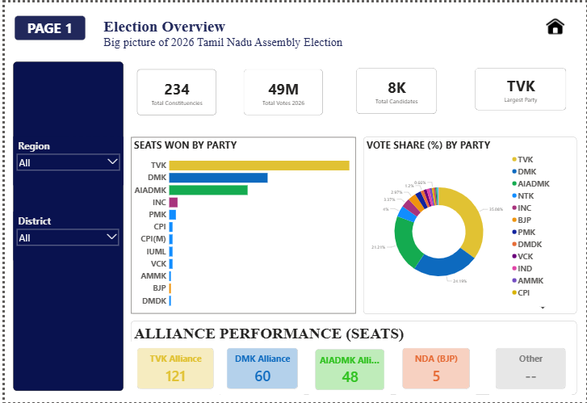
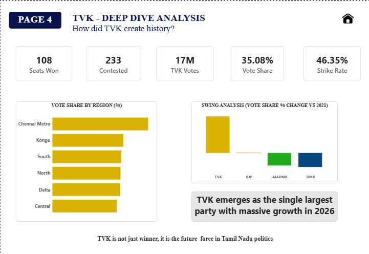

# Tamil Nadu Assembly Election 2026 Dashboard

## Project Overview

This Power BI dashboard analyzes Tamil Nadu Assembly Election 2026 results using constituency-level data.

The dashboard provides insights into:

- Seat Share Analysis
- Vote Share Analysis
- Alliance Performance
- Regional Performance
- Swing Analysis (2021 vs 2026)
- TVK Deep Dive
- Constituency-Level Insights

## Tools Used

- Power BI
- Power Query
- DAX
- Excel

## Key KPIs

- Total Seats Won
- Vote Share %
- Strike Rate
- Regional Seat Share
- Vote Share Growth
- Largest Party
- Alliance Performance

## Dashboard Screenshots

### Election Overview

### Party Comparison

### TVK Deep Dive

## Key Learnings

- Data Cleaning using Power Query
- DAX Measure Creation
- Data Modeling
- Interactive Dashboard Design
- Data Storytelling

## Author

Shraddha Chaudhari
